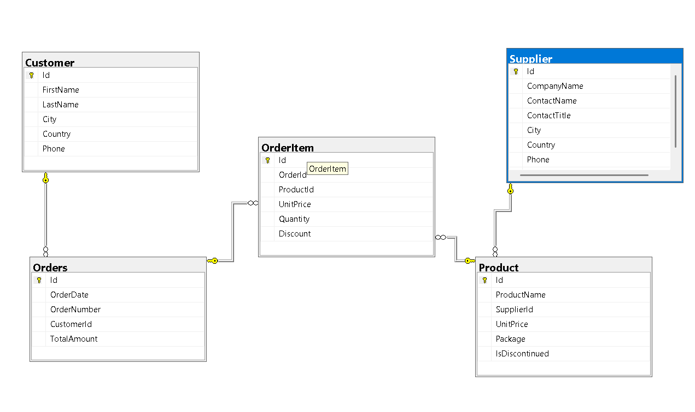

# 🛒 E-Commerce Advance SQL Case Study ; 

## 📖 Project Overview

This project contains my solutions to an advanced SQL case study based on an E-Commerce relational database. The case study was completed as part of my SQL learning journey to strengthen my understanding of SQL and its application in solving real-world business problems.

The project demonstrates how SQL can be used to retrieve, manipulate, and analyze business data by solving a series of business-oriented SQL queries using multiple related tables.

---

# 💼 Business Problem

An international e-commerce company stores its operational data across multiple relational tables, including **Customers**, **Orders**, **Order Items**, **Products**, and **Suppliers**.

As the business continues to grow, different departments such as Sales, Marketing, Inventory, Customer Support, and Procurement require accurate information to monitor business performance and support daily operations. Since the data is distributed across multiple tables, extracting meaningful information requires writing efficient SQL queries.

As a Data Analyst, the objective is to develop SQL solutions that help answer business questions related to customer management, sales reporting, product performance, supplier management, and database administration.

This project solves **37 business-oriented SQL problems** that simulate common reporting and operational requirements in an e-commerce business environment.

---

# 🎯 Project Objective

The objective of this project is to demonstrate SQL proficiency by solving business-oriented SQL problems using an E-Commerce relational database.

The project focuses on:

- Customer Analytics
- Sales Reporting
- Product Analysis
- Supplier Analysis
- Database Administration
- Data Manipulation
- Business Reporting

---

# 🗃️ Database Schema

The database consists of the following relational tables:

| Table | Description |
|--------|-------------|
| Customer | Customer information |
| Orders | Customer order details |
| OrderItem | Products purchased in each order |
| Product | Product catalog |
| Supplier | Supplier information |

## 🗃️ Entity Relationship Diagram



---

# 📊 Business Requirements Solved

## 👥 Customer Analytics

- Retrieve customer information
- Generate customer location reports
- Count customers by country
- Identify inactive customers
- Find high-value customers
- Match customers from the same city and country
- Analyze customer purchasing behavior

---

## 💰 Sales Analytics

- Calculate customer order values
- Generate monthly sales reports
- Analyze yearly sales performance
- Identify top customers by revenue
- Find low quantity purchases
- Calculate customer spending

---

##  Product Analytics

- Retrieve product information
- Identify expensive products
- Rank products by price
- Find above-average priced products
- Discontinue products in a working table
- Filter products using pattern matching

---

## 🚚 Supplier Analytics

- Retrieve supplier information
- Identify suppliers by country
- Detect missing supplier information
- Compare supplier and customer locations
- Identify customer countries without suppliers

---

##  Database Administration

- Create table copies
- Update records
- Delete records
- Add new columns
- Create Views
- Create Stored Procedures
- Perform database maintenance tasks

---

# 🧠 SQL Concepts Demonstrated

### SQL Fundamentals

- SELECT
- WHERE
- ORDER BY
- DISTINCT
- TOP
- OFFSET FETCH

### Aggregation

- COUNT()
- SUM()
- AVG()
- GROUP BY
- HAVING

### Joins

- INNER JOIN
- LEFT JOIN
- RIGHT JOIN
- SELF JOIN

### Advanced SQL

- CASE Expressions
- Subqueries
- Correlated Subqueries
- Common Table Expressions (CTEs)
- Window Functions (DENSE_RANK)

### Database Objects

- Views
- Stored Procedures
- CREATE TABLE
- ALTER TABLE
- UPDATE
- DELETE

---

# 📂 Project Structure

```
E-Commerce-SQL-Business-Case-Study
│
├── Dataset
│   ├── Customer.csv
│   ├── Orders.csv
│   ├── OrderItem.csv
│   ├── Product.csv
│   └── Supplier.csv
│
├── SQL_Solutions.sql
├── SQL Case Study.pdf
├── ER_Diagram.png
└── README.md
```

---

#  Skills Demonstrated

- SQL Query Writing
- Data Retrieval
- Data Manipulation
- Relational Database Management
- Customer Analytics
- Sales Analytics
- Product Analytics
- Supplier Analytics
- SQL Server
  
---

#  Key Learning Outcomes

Through this project, I gained hands-on experience in:

- Writing optimized SQL queries
- Working with relational databases
- Solving business-oriented SQL problems
- Using Joins, Subqueries, CTEs, and Window Functions
- Creating Views and Stored Procedures
- Performing CRUD operations
- Supporting business reporting using SQL

---

# 🛠️ Tools & Technologies

- Microsoft SQL Server
- SQL Server Management Studio (SSMS)
  
---

#  Case Study

This project is based on an advanced SQL case study completed as part of my SQL learning journey. The repository contains my own SQL solutions to the business questions provided in the case study.

---

#  Repository Highlights

-  Solved **37 SQL Business Problems**
-  Worked with a normalized relational database
-  Applied advanced SQL concepts
-  Used Joins, CTEs, Window Functions, Views, and Stored Procedures
-  Demonstrated SQL skills for business reporting and database management

---

## 👩‍💻 Author

**Vikas Nagar**

If you found this project helpful, feel free to ⭐ the repository.
